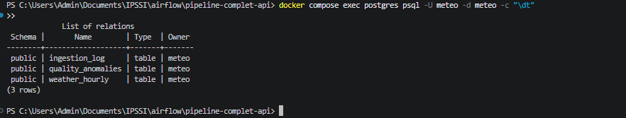
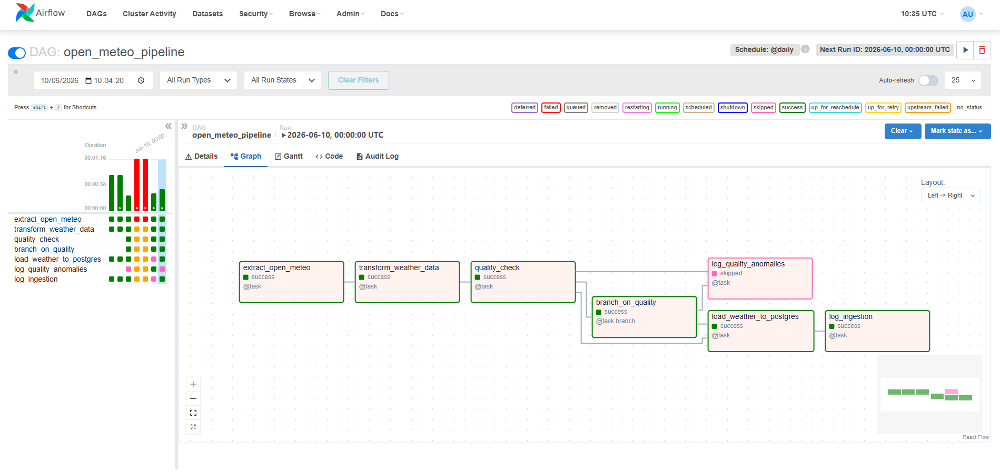
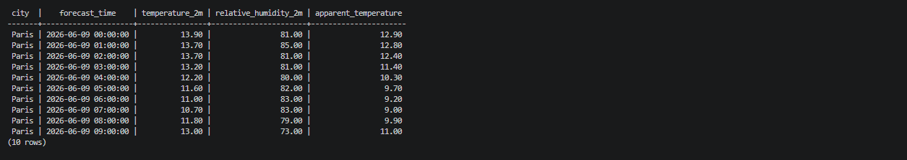
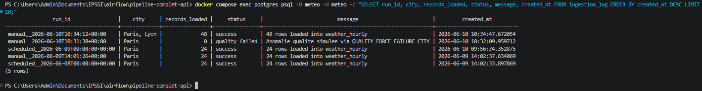
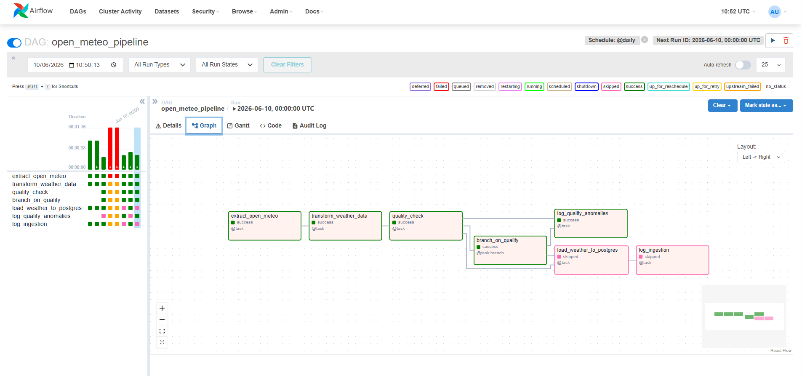
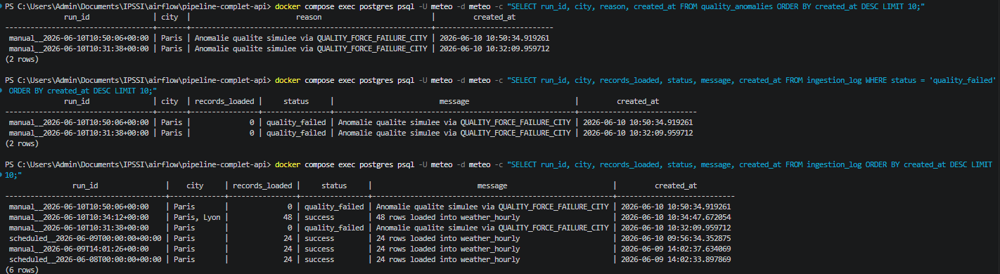

# TP 5 - Industrialisation d'un pipeline Airflow Open-Meteo

## Description du pipeline

Ce projet industrialise un pipeline Airflow autour de l'API Open-Meteo.

Le pipeline :
- extrait des donnees meteo depuis une API externe ;
- archive les donnees brutes dans `data/raw` ;
- transforme les donnees dans `data/prepared` ;
- controle leur qualite ;
- charge uniquement les donnees valides dans PostgreSQL ;
- trace le resultat de l'execution dans des tables de suivi.

L'objectif est d'obtenir un pipeline lisible, relancable, parametrable et plus robuste qu'une simple version monolithique.

## Schema du workflow

```text
extract_open_meteo
        |
transform_weather_data
        |
quality_check
        |
 branch_on_quality
    |           |
    |           +--> log_quality_anomalies
    |
    +--> load_weather_to_postgres --> log_ingestion
```

## Structure du projet

```text
pipeline-complet-api/
+-- dags/
|   \-- open_meteo_pipeline.py
+-- include/
|   \-- open_meteo_pipeline/
|       +-- __init__.py
|       +-- config.py
|       +-- runtime.py
|       +-- storage.py
|       +-- extract.py
|       +-- transform.py
|       +-- quality.py
|       +-- load.py
|       \-- ingestion.py
+-- sql/
|   \-- create_tables.sql
+-- data/
|   +-- raw/
|   \-- prepared/
+-- doc/
|   \-- screenshots/
+-- logs/
+-- postgres-data/
+-- .env
+-- .env.example
+-- docker-compose.yml
+-- PLAN_TEST_TP5.md
\-- README.md
```

## Liste des variables Airflow utilisees

Les variables de configuration sont injectees dans le conteneur via `.env` et `docker-compose.yml`.

Variables principales :
- `OPEN_METEO_BASE_URL`
- `RAW_DATA_DIR`
- `PREPARED_DATA_DIR`
- `PIPELINE_CITIES`
- `PIPELINE_CITY`
- `PIPELINE_LATITUDE`
- `PIPELINE_LONGITUDE`
- `PIPELINE_HOURLY_VARIABLES`
- `QUALITY_FORCE_FAILURE_CITY`
- `TASK_RETRIES`
- `TASK_RETRY_DELAY_SECONDS`
- `TASK_TIMEOUT_SECONDS`
- `TARGET_POSTGRES_HOST`
- `TARGET_POSTGRES_PORT`
- `TARGET_POSTGRES_DB`
- `TARGET_POSTGRES_USER`
- `TARGET_POSTGRES_PASSWORD`

Exemple :

```env
PIPELINE_CITIES=Paris|48.8566|2.3522;Lyon|45.7640|4.8357
QUALITY_FORCE_FAILURE_CITY=
TASK_RETRIES=2
TASK_RETRY_DELAY_SECONDS=30
TASK_TIMEOUT_SECONDS=120
```

## Liste des connexions Airflow utilisees

Connexions Airflow declarees dans l'interface :
- aucune connexion Airflow dediee n'est utilisee dans cette version

Acces techniques utilises :
- appel API Open-Meteo via `requests`
- connexion PostgreSQL via `psycopg2` et variables d'environnement

Limite :
- une version plus industrialisee utiliserait idealement une connexion Airflow pour PostgreSQL et potentiellement un Hook Airflow dedie.

## Description des taches du DAG

### `extract_open_meteo`

Recupere les donnees Open-Meteo pour chaque ville configuree et sauvegarde un fichier brut par ville dans `data/raw`.

### `transform_weather_data`

Transforme les donnees brutes en lignes exploitables pour PostgreSQL et ecrit un fichier prepare par ville dans `data/prepared`.

### `quality_check`

Verifie que les donnees preparees sont chargeables :
- au moins une ligne preparee ;
- pas de valeur obligatoire manquante ;
- possibilite de simuler une anomalie via `QUALITY_FORCE_FAILURE_CITY`.

### `branch_on_quality`

Effectue le branchement conditionnel :
- si la qualite est validee, le pipeline charge PostgreSQL ;
- sinon, il journalise l'anomalie sans charger la table metier.

### `load_weather_to_postgres`

Charge les lignes valides dans `weather_hourly` avec une logique idempotente basee sur `ON CONFLICT`.

### `log_ingestion`

Ecrit une trace d'execution nominale dans `ingestion_log`.

### `log_quality_anomalies`

Ecrit les anomalies qualite dans `quality_anomalies` et une trace de refus dans `ingestion_log`.

## Strategie de robustesse

Le pipeline met en place plusieurs mecanismes de robustesse :
- separation claire entre extraction, transformation, qualite, chargement et journalisation ;
- code decoupe en modules Python separes ;
- retries parametrables via `TASK_RETRIES` ;
- `retry_delay` parametrable via `TASK_RETRY_DELAY_SECONDS` ;
- `execution_timeout` parametrable via `TASK_TIMEOUT_SECONDS` ;
- logs applicatifs sur les etapes principales ;
- erreurs reseau remontees a Airflow pour laisser la strategie de retry s'appliquer ;
- branchement conditionnel pour eviter de charger des donnees non valides.

## Strategie d'idempotence

L'idempotence repose principalement sur la table `weather_hourly`.

La table possede une contrainte d'unicite sur :
- `city`
- `latitude`
- `longitude`
- `forecast_time`

Le chargement utilise :

```sql
ON CONFLICT (city, latitude, longitude, forecast_time)
DO UPDATE
```

Cela permet :
- de relancer le DAG sans dupliquer les lignes existantes ;
- de remettre a jour les valeurs si une meme ligne est rechargee.

## Controles qualite mis en place

Les controles actuellement implementes sont :
- verification qu'un fichier prepare contient au moins une ligne ;
- verification que `temperature_2m` n'est pas `NULL` ;
- verification que `relative_humidity_2m` n'est pas `NULL` ;
- verification que `apparent_temperature` n'est pas `NULL` ;
- possibilite de simulation d'echec qualite via `QUALITY_FORCE_FAILURE_CITY`.

## Regle de branchement conditionnel

La regle de branchement est simple :
- si `quality_result["is_valid"] == True`, execution de `load_weather_to_postgres`
- sinon, execution de `log_quality_anomalies`

Le chargement final ne doit donc pas avoir lieu en cas d'anomalie qualite.

## Description des logs produits

Des logs applicatifs sont emis dans :
- `extract.py`
- `transform.py`
- `quality.py`
- `load.py`
- `ingestion.py`
- `open_meteo_pipeline.py`

Exemples de messages journalises :
- extraction Open-Meteo par ville ;
- nombre de lignes preparees ;
- validation ou echec du controle qualite ;
- chargement PostgreSQL par ville ;
- ecriture du suivi d'ingestion ;
- ecriture des anomalies qualite.

Les logs sont consultables :
- dans l'interface Airflow, onglet `Logs` ;
- dans le dossier `logs/` ;
- via `docker compose logs airflow`.

## Description des tables PostgreSQL

### `weather_hourly`

Table metier finale contenant les donnees meteo horaires chargees.

Colonnes principales :
- `city`
- `latitude`
- `longitude`
- `forecast_time`
- `temperature_2m`
- `relative_humidity_2m`
- `apparent_temperature`
- `ingested_at`

### `ingestion_log`

Table de suivi des executions du pipeline.

Colonnes principales :
- `pipeline_name`
- `run_id`
- `city`
- `records_loaded`
- `status`
- `message`
- `created_at`

### `quality_anomalies`

Table de trace des anomalies qualite detectees.

Colonnes principales :
- `pipeline_name`
- `run_id`
- `city`
- `reason`
- `created_at`

## Modules Python separes

Le projet contient les modules Python suivants :
- [`config.py`](include/open_meteo_pipeline/config.py)
- [`runtime.py`](include/open_meteo_pipeline/runtime.py)
- [`storage.py`](include/open_meteo_pipeline/storage.py)
- [`extract.py`](include/open_meteo_pipeline/extract.py)
- [`transform.py`](include/open_meteo_pipeline/transform.py)
- [`quality.py`](include/open_meteo_pipeline/quality.py)
- [`load.py`](include/open_meteo_pipeline/load.py)
- [`ingestion.py`](include/open_meteo_pipeline/ingestion.py)

## Scripts SQL necessaires

Le script SQL principal est :
- [`sql/create_tables.sql`](sql/create_tables.sql)

Il cree :
- `weather_hourly`
- `ingestion_log`
- `quality_anomalies`

Attention :
- ces scripts ne sont joues automatiquement par PostgreSQL qu'au premier demarrage d'une base vide ;
- si le volume `postgres-data` existe deja, il faut rejouer le script manuellement.

Commande utile :

```powershell
docker compose exec postgres psql -U meteo -d meteo -f /docker-entrypoint-initdb.d/create_tables.sql
```

## Commandes utiles

Lancement :

```powershell
docker compose up -d
```

Redemarrage Airflow :

```powershell
docker compose restart airflow
```

Verification des tables :

```powershell
docker compose exec postgres psql -U meteo -d meteo -c "\dt"
```

Visuel des tables :



Verification des logs Airflow :

```powershell
docker compose logs airflow
```

## Preuves d'execution

Les preuves detaillees sont preparees dans [PLAN_TEST_TP5.md](PLAN_TEST_TP5.md).

### Preuve d'execution nominale

A fournir :
- capture du DAG en succes ;
- preuve SQL du contenu de `weather_hourly` ;
- preuve SQL du contenu de `ingestion_log`.

Captures disponibles a date :







### Preuve d'execution avec anomalie qualite

Cas execute avec :

```env
QUALITY_FORCE_FAILURE_CITY=Paris
```

Preuves disponibles :
- graphe Airflow montrant le chemin anomalie ;
- contenu de `quality_anomalies` ;
- contenu de `ingestion_log` avec `status = 'quality_failed'` ;
- verification que le chargement metier n'est pas execute pour ce run.





### Preuve de relance sans doublon

Preuves attendues :
- meme comptage ou comptage stable apres relance ;
- requete d'unicite sans doublon dans `weather_hourly`.

Requete utile :

```powershell
docker compose exec postgres psql -U meteo -d meteo -c "SELECT city, latitude, longitude, forecast_time, COUNT(*) FROM weather_hourly GROUP BY city, latitude, longitude, forecast_time HAVING COUNT(*) > 1;"
```

### Preuve des logs Airflow

Preuves attendues :
- logs d'extraction ;
- logs de transformation ;
- logs de controle qualite ;
- logs de chargement ;
- logs d'anomalie si echec qualite.

## Limites eventuelles du travail rendu

Limites actuelles :
- les connexions Airflow ne sont pas encore gerees via les objets `Connection` de l'interface Airflow ;
- le support du formulaire de trigger manuel Airflow autour du parametre `cities` est plus fragile que l'execution avec configuration par `.env` ;
- les preuves du cas anomalie qualite et du cas de relance sans doublon restent a produire si elles n'ont pas encore ete capturees ;
- le schema logique est present en ASCII dans le README, mais pas encore sous forme de diagramme image ;
- la creation automatique des nouvelles tables SQL ne s'applique pas retroactivement si PostgreSQL a deja initialise son volume.
